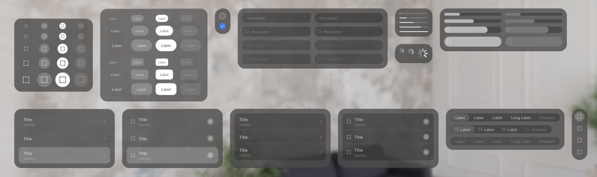
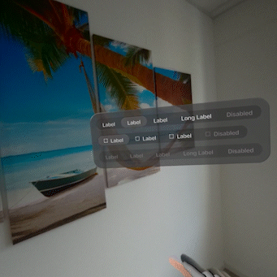
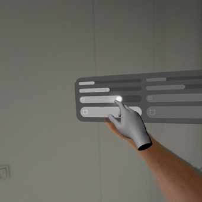
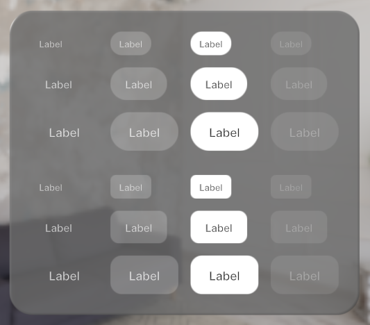
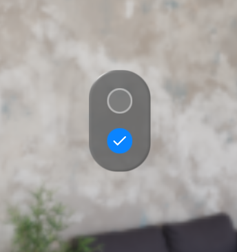
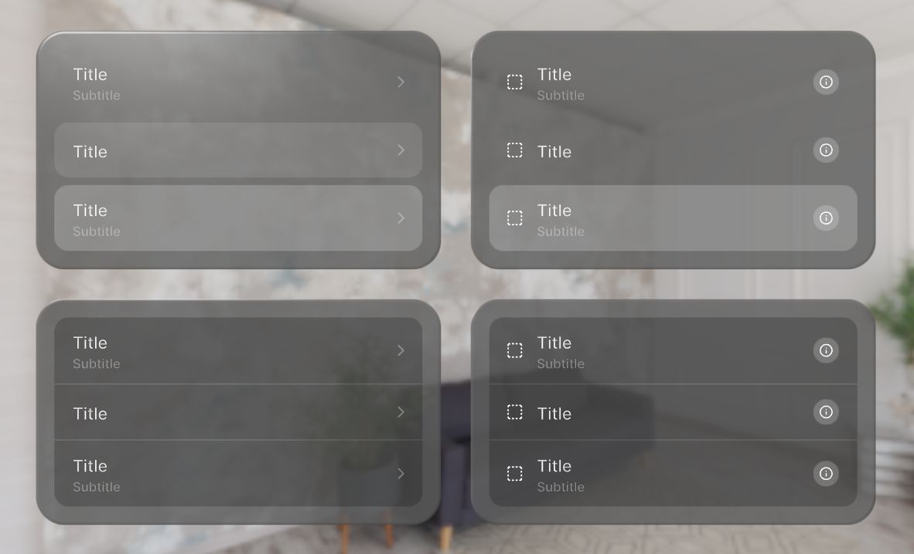
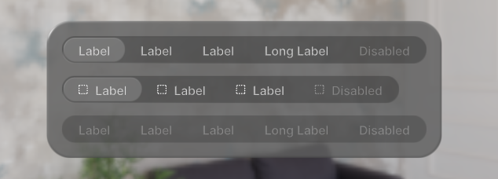
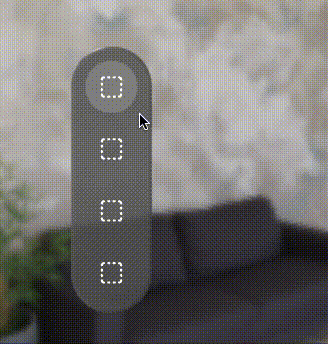

# @coconut-xr/apfel-kruemel

*Pre-Designed Component Library for Spatial User Interfaces rendered in Three.js*

This library provides a collection of pre-designed components for spatial user interfaces built on top of [@coconut-xr/koestlich](https://github.com/coconut-xr/koestlich) (immersive ui library) and [@coconut-xr/natuerlich](https://github.com/coconut-xr/natuerlich) (immersive interaction library).

### Getting started with apfel-kruemel

Explore all components in the [examples](https://coconut-xr.github.io/apfel-kruemel/examples/), learn more about all components in the [documentation](https://coconut-xr.github.io/apfel-kruemel/docs/), use and test all components in a [CodeSandbox](https://codesandbox.io/s/apfel-kruemel-examples-ld9xk5?file=/src/pages/Buttons.tsx), or go through a [tutorial](https://github.com/coconut-xr/getting-started) for apfel-kruemel and the whole coconut-xr ecosystem.

## [Documentation](https://coconut-xr.github.io/apfel-kruemel/docs/)

* [Buttons 
](https://coconut-xr.github.io/apfel-kruemel/docs/#/buttons)

* [Checkboxes ](https://coconut-xr.github.io/apfel-kruemel/docs/#/checkboxes)

* [InputFields ](https://coconut-xr.github.io/apfel-kruemel/docs/#/inputFields)

* [Lists ](https://coconut-xr.github.io/apfel-kruemel/docs/#/lists)

* [SegmentedControls ](https://coconut-xr.github.io/apfel-kruemel/docs/#/segmentedControls)

* [Slider ](https://coconut-xr.github.io/apfel-kruemel/docs/#/slider)

* [ProgressIndicators](https://coconut-xr.github.io/apfel-kruemel/docs/#/progressIndicators) 
</a>

* [TabBars](https://coconut-xr.github.io/apfel-kruemel/docs/#/tabBars) 

## Tutorials

- [Immersive Music Player ](https://github.com/coconut-xr/getting-started)

---

**apfel-kruemel** is funded by [Coconut Capital](https://coconut.capital/)
