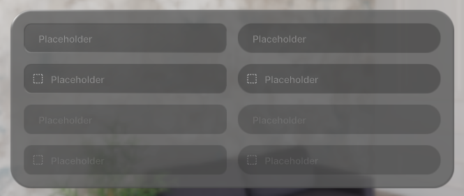
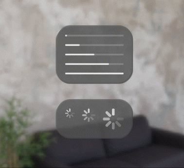
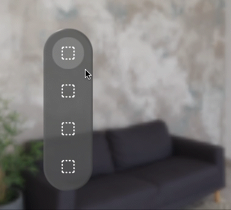

# @coconut-xr/apfel-kruemel

*Pre-Designed Component Library for Spatial User Interfaces*

This library provides a collection of pre-designed components for spatial user interfaces built on top of [@coconut-xr/koestlich](https://github.com/coconut-xr/koestlich) (immersive ui library) and [@coconut-xr/natuerlich](https://github.com/coconut-xr/natuerlich) (immersive interaction library).

### Getting started with apfel-kruemel

Explore all components in the [examples](https://coconut-xr.github.io/apfel-kruemel/examples/), learn more about all components in the [documentation](https://coconut-xr.github.io/apfel-krueme./), use and test all components in a [CodeSandbox](https://codesandbox.io/s/apfel-kruemel-examples-ld9xk5?file=/src/pages/Buttons.tsx), or go through a [tutorial](https://github.com/coconut-xr/getting-started) for apfel-kruemel and the whole coconut-xr ecosystem.

## [Documentation](https://coconut-xr.github.io/apfel-krueme./)

* [Buttons](https://coconut-xr.github.io/apfel-krueme./#/buttons)

    

* [Checkboxes](https://coconut-xr.github.io/apfel-krueme./#/checkboxes)

    

* [InputFields](https://coconut-xr.github.io/apfel-krueme./#/inputFields)

    

* [Lists](https://coconut-xr.github.io/apfel-krueme./#/lists)

    

* [SegmentedControls](https://coconut-xr.github.io/apfel-krueme./#/segmentedControls)

    

* [Slider](https://coconut-xr.github.io/apfel-krueme./#/slider)

    

* [ProgressIndicators](https://coconut-xr.github.io/apfel-krueme./#/progressIndicators)

    

* [TabBars](https://coconut-xr.github.io/apfel-krueme./#/tabBars)

    

## Tutorials

- [Immersive Music Player](https://github.com/coconut-xr/getting-started)

    

---

**apfel-kruemel** is funded by [Coconut Capital](https://coconut.capital/)
