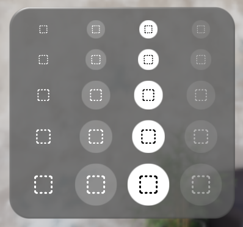

# Buttons

Displays a button.

[Interactive Example](https://coconut-xr.github.io/apfel-kruemel/examples/#/buttons) | [CodeSandbox](https://codesandbox.io/s/apfel-kruemel-examples-ld9xk5?file=/src/pages/Buttons.tsx)

## Icon Button



<br>

### Code Example

```tsx
import { Button, Glass, IconButton } from "@coconut-xr/apfel-kruemel";
import { Container, Text } from "@coconut-xr/koestlich";
import { BoxSelect } from "@coconut-xr/lucide-koestlich";

export default function IconButton() {
  return (
    <Glass borderRadius={32} padding={16}>
        <IconButton size="md">
            <BoxSelect />
        </IconButton>
    </Glass>
  );
}
```

#### Icon Button Params

| Name   | Type    | Attributes               | Description        |
|------- |-------- |------------------------- |------------------- |
| size  | Size  | optional / default: "md"  | Sets the size of the button. Options are "sm" / "md" / "lg" |
| platter  | boolean  | optional / default: false  | If true, changes the appearance of the icon button to a platter state   |
| selected  | boolean  | optional / default: false  | If true, changes the appearance of the icon button to a selected state |
| disabled  | boolean  | optional / default: false  | If true, disable all interactions for the button |

<br>

## Text Button


### Code Example

```tsx
import { Button, Glass, IconButton } from "@coconut-xr/apfel-kruemel";
import { Container, Text } from "@coconut-xr/koestlich";
import { BoxSelect } from "@coconut-xr/lucide-koestlich";

export default function TextButton() {
  return (
    <Glass borderRadius={32} padding={16}>
        <Button style="rect" size="md" selected>
            <Text>Label</Text>
        </Button>
    </Glass>
  );
}
```

#### Button Params

| Name   | Type    | Attributes               | Description        |
|------- |-------- |------------------------- |------------------- |
| size  | Size  | optional / default: "md"  | Sets the size of the button. Options are "sm" / "md" / "lg" |
| style  | Style  | optional / default: "rect"  | Style of the button. Options are "rect" / "pill"  |
| platter  | boolean  | optional / default: false  | If true, changes the appearance of the button to a platter state   |
| selected  | boolean  | optional / default: false  | If true, changes the appearance of the button to a selected state |
| disabled  | boolean  | optional / default: false  | If true, disable all interactions for the button |
