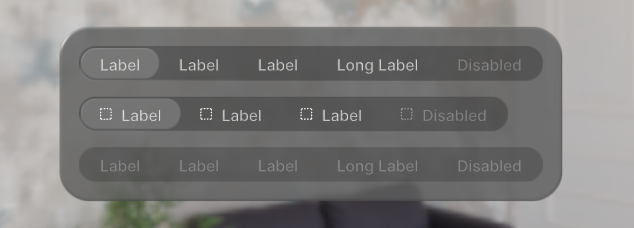
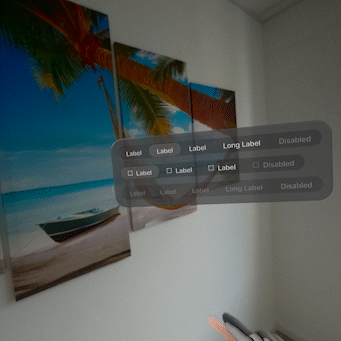

# Segmented Controls

A component enabling the user to make a choice among a set of mutually exclusive options.

[Interactive Example](https://coconut-xr.github.io/apfel-kruemel/examples/#/segmented-controls) | [CodeSandbox](https://codesandbox.io/s/apfel-kruemel-examples-ld9xk5?file=/src/pages/SegmentedControls.tsx)

 

<br>

### Code Example

```tsx
import {
  Glass,
  SegmentedControl,
  SegmentedControlButton,
} from "@coconut-xr/apfel-kruemel";

export default function SegmentedControl() {
  return (
    <SegmentedControl defaultValue={1}>
        <SegmentedControlButton value={1}>
            <Text>Label</Text>
        </SegmentedControlButton>
        <SegmentedControlButton value={2}>
            <Text>Label</Text>
        </SegmentedControlButton>
        <SegmentedControlButton value={3}>
            <Text>Label</Text>
        </SegmentedControlButton>
        <SegmentedControlButton value={4}>
            <Text>Long Label</Text>
        </SegmentedControlButton>
        <SegmentedControlButton value={5} disabled>
            <Text>Disabled</Text>
        </SegmentedControlButton>
    </SegmentedControl>
  );
}
```

#### Params

___Segmented Control___

| Name   | Type    | Attributes               | Description        |
|------- |-------- |------------------------- |------------------- |
| value  | T  | optional  | The current selected segment of the segmented control |
| defaultValue  | T  | optional  | The default selected segment of the segemented control |
| onValueChange  | (value: T) => void  | optional | Callback that is fired when the user selects a new segment |
| disabled  | boolean  | optional / default: false  | If true, disable all interactions for the segemented control |

___Segmented Controll Button___

| Name   | Type    | Attributes               | Description        |
|------- |-------- |------------------------- |------------------- |
| value  | T  | -  | The current value of the segmented control button |
| disabled  | boolean  | optional / default: false  | If true, disable all interactions for the segemented control button |
